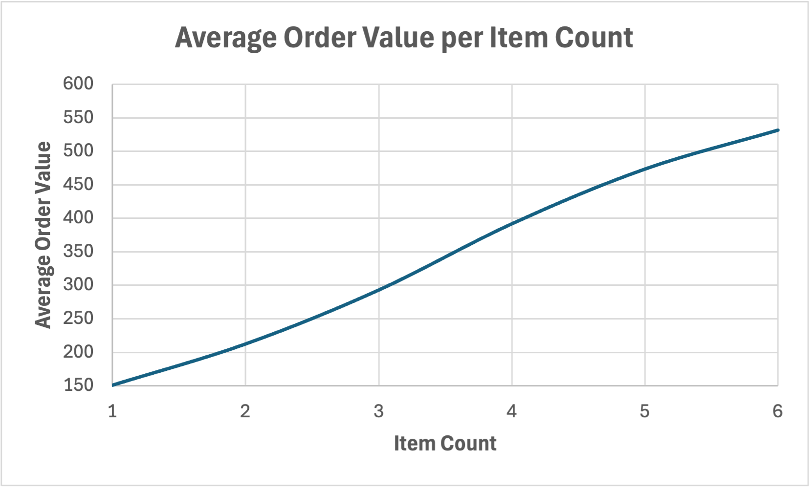
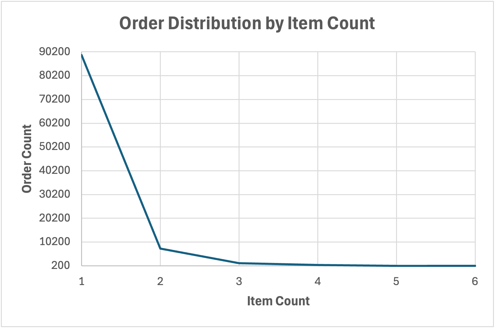
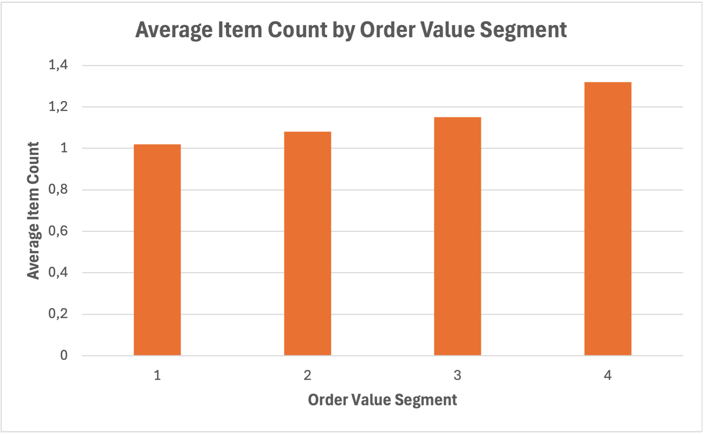
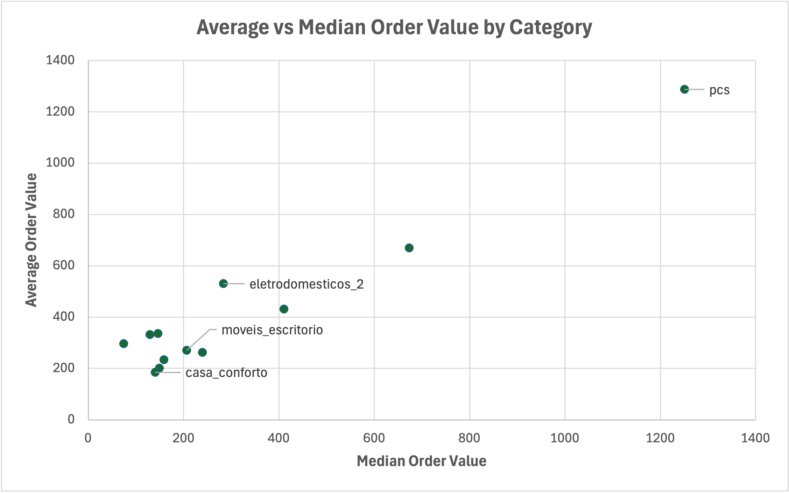

# E-Commerce Order Value Analysis

## Objective

The goal of this project is to understand what actually drives order value in an e-commerce setting.

The analysis focuses on two angles:

- Order structure (number of items per order)  
- Product characteristics (categories and pricing behavior)  

---

## Dataset

This project uses the Olist E-Commerce dataset:

https://www.kaggle.com/datasets/olistbr/brazilian-ecommerce

---

## Key Questions

- Does adding more items to an order meaningfully increase order value?  
- Which product categories are associated with high-value orders?  

---

## Key Insights

- Order value increases with item count, but the effect is limited  
- Most orders consist of a single item, including many high-value orders  
- High order values are primarily driven by higher prices per item  
- Categories differ not only in average value, but also in stability and distribution  
- Average values alone can be misleading without considering the median  

---

## Analysis 1: Item Count and Order Value

The starting assumption was straightforward:

More items per order → higher order value.

The data partially supports this:

- Average order value increases with item count  
- The relationship is stable for small item counts (1–6 items)  

### Visualization

However, this view needs to be put into context.

### Visualization

The distribution shows:

- The vast majority of orders contain only one item  
- Orders with multiple items are relatively rare  

This significantly limits the impact of item count as a driver.

---

To validate this further, the perspective was reversed:

Instead of asking how item count affects order value,  
the question becomes:

**What do high-value orders actually look like?**

### Visualization

Result:

- Item count increases only slightly across order value segments  
- High-value orders still mostly contain few items  

**Conclusion:**

Item count has an effect, but it is not a primary driver of order value in this dataset.

---

## Analysis 2: Product Category Impact

To better understand what drives high order values, the analysis shifts to product categories.

Categories are evaluated using:

- Average order value (AVG)  
- Median order value  
- Difference between AVG and Median  
- Share of high-value orders  

This allows distinguishing between:

- consistently high-value categories  
- categories affected by outliers  
- categories that appear in large orders without driving them  

### Key observations

- Some categories (e.g. `pcs`) are consistently associated with high-value orders  
- Some categories show high averages but are strongly skewed  
- Others frequently appear in high-value orders without having high intrinsic value  

---

### Visualization

---

## Example: Category Comparison

| Category            | Avg Order Value |  Median | High-Value Ratio |
|:--------------------|----------------:|--------:|-----------------:|
| pcs                 |         1286.95 | 1250.81 |             0.99 |
| eletrodomesticos_2  |          529.75 |  283.27 |             0.79 |
| moveis_escritorio   |          270.90 |  206.84 |             0.63 |
| casa_conforto       |          185.13 |  140.06 |             0.45 |

---

## Conclusion

At first glance, order value seems to increase with the number of items per order.

A closer look shows that this effect is limited, as most orders — including high-value ones — consist of only a few items.

The primary driver of order value is the price per item.

Product categories add an additional layer:

They differ not only in price level, but also in how consistently they contribute to high-value orders.

**Takeaway:**

Order value is not driven by a single factor,  
but by the interaction between:

- price level  
- category behavior  
- and, to a lesser extent, order size  